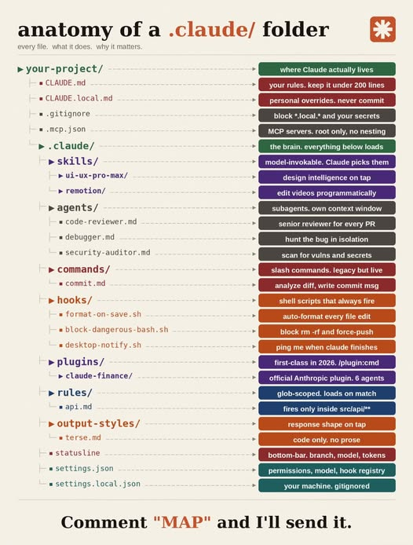
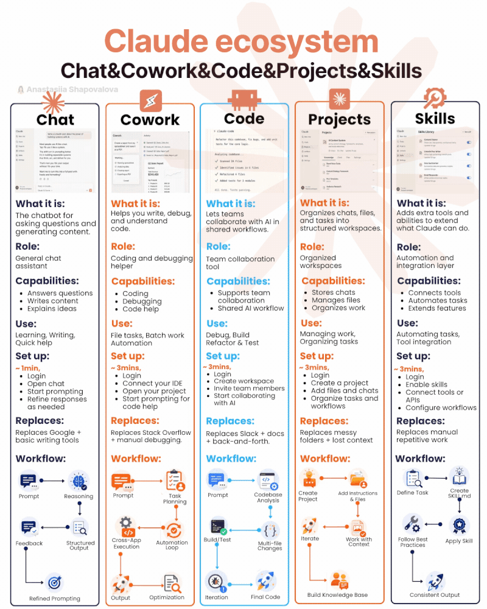

<p align="center"></p>
<h1 align="center"> Claude AI </h1> 
<h4 align="right">Jul 26</h4>

<p>
  
  
</p>

<br>

# Table of contents
- [Table of contents](#table-of-contents)
- [Claude desde terminal:](#claude-desde-terminal)
  - [Install](#install)
  - [Start](#start)
- [Tools Claude](#tools-claude)
- [Skills](#skills)
  - [Skill (Definition)](#skill-definition)
  - [MCP (Model Context Protocol)](#mcp-model-context-protocol)

<br>

<p align="center"></p>

<br>

<p align="center"></p>

# Claude desde terminal:
## Install
Desde PowerShell:
```PowerShell
irm https://claude.ai/install.ps1 | iex
```

install: from CMD:
```PowerShell
curl -fsSL https://claude.ai/install.cmd -o install.cmd && install.cmd && del install.cmd
```

Solo falta agregar esa carpeta a tu PATH:
```PowerShell
[Environment]::SetEnvironmentVariable('PATH', "$([Environment]::GetEnvironmentVariable('PATH','User'));$env:USERPROFILE\.local\bin", 'User')
# Tambien agrega este patch:
$env:PATH += ";$env:USERPROFILE\.local\bin"
```
> :warning: **Warning:** Después cierra PowerShell por completo y abre una ventana nueva (esto es importante, el cambio no aplica a la ventana actual). 

> :warning: **Warning:** Si hay error probar si el problemas es de sesion. 
```PowerShell
& "$env:USERPROFILE\.local\bin\claude.exe"
```

## Start
Escribe ```claude```
* ```/login``` para autenticarte
* ```Esc``` interrumpe a Claude si está trabajando
* ```/help``` muestra los comandos disponibles
* ```/skills``` ver todos los Skills disponibles
* ```/plugin list``` ver los plugins instalados
* ```exit``` o ```Ctrl+D``` para salir

> :memo: **Note:** Deberia correr tambien desde CMD, PowerShell 
> :memo: **Note:** Carpeta de configuracion de claude ```cd ~/.claude/``` o ```%USERPROFILE%\.claude\skills\```


<br>

# Tools Claude

```Claude-StatusBar``` Status Bar para Claude Code escrito en bash. Muestra modelo, contexto, tokens, rate limits y duración de sesión en una sola línea, con animaciones suaves a 1 Hz.
Install:
```PowerShell
git clone https://github.com/afsh4ck/Claude-Status-Bar.git
cd Claude-Status-Bar
bash install.sh
```
> :warning: **Warning:** Reinicia Claude Code una vez finalizado.

> :warning: **Warning:** Si hay un error como :
```PowerShell
/c/Users/carja/AppData/Local/Microsoft/WindowsApps/python3: Permission denied
```
Edita el install.sh linea 37
después de esta linea: 
```PowerShell
_python=$(command -v python 2>/dev/null || command -v python3 2>/dev/null || echo "")
```
pon esta:
```PowerShell
_python=$(command -v python3 2>/dev/null || command -v python 2>/dev/null || echo "")

if [[ "$_python" == *"WindowsApps/python3"* ]]; then
    _python=$(command -v python 2>/dev/null || echo "")
fi
```


<br>

# Skills
Inicialmente es necesario crear la carpeta
```PowerShell
mkdir -p ~/.claude/skills
```
<br>

```prompt-master``` es una skill que te ayuda a redactar mejores prompts para cualquier herramienta de IA (Claude, ChatGPT, Midjourney, Cursor, etc.), en lugar de que tú lo hagas a mano por ensayo y error.
```PowerShell
git clone https://github.com/nidhinjs/prompt-master.git ~/.claude/skills/prompt-master
```
***Usage:*** I need a prompt for Claude Code to build...

<br>

```grill-me``` (Interrogame) es un Skill para Claude Code cuyo objetivo es evitar que el modelo empiece a programar haciendo suposiciones. En lugar de generar código inmediatamente, el skill te entrevista de forma sistemática hasta entender completamente el problema.
Agregar el Marketplace:
```bash
# Dentro de Claude Code ejecuta:
/plugin marketplace add alirezarezvani/claude-skills
/plugin install grill-me@claude-code-skills
/plugin list # para verificar que esta instalado
```
***Usage:*** Quiero hacer un sistema... Grill me on this architecture... Grill me before implementing this project.


<br>

## Skill (Definition)

Una Skill es una capacidad específica que un sistema AI puede ejecutar para resolver una tarea concreta.

Ejemplos:

* "Convertir un PDF a texto"
* "Consultar una base de datos"
* "Enviar un correo"
* "Controlar una impresora 3D"
* "Generar un reporte Excel"

Una Skill normalmente tiene:

* Nombre
* Descripción de lo que hace
* Parámetros de entrada
* Resultado esperado
* Reglas de uso

> :bulb: **Tip:** Un agente AI puede decidir cuándo usar esa Skill.

<br>

## MCP (Model Context Protocol)

MCP = Model Context Protocol

Es un estándar creado para conectar modelos AI con herramientas, datos y sistemas externos de forma estructurada.

La idea es:
```
Modelo AI
    |
    |
    MCP
    |
-----------------
|       |       |
Base   API    Archivo
datos          sistema
```
En vez de programar una integración diferente para cada AI, MCP define una forma común.

Ejemplos de recursos conectables:

* Bases de datos
* GitHub
* Sistemas internos
* APIs
* Archivos locales
* Herramientas empresariales

Ejemplo:
Un asistente AI recibe:
"Busca los errores del proyecto y crea un reporte"
El modelo usa MCP para:

1. Leer repositorio
2. Revisar logs
3. Crear documento

<br>

<p align="center"></p>


<br>

---

<div>
  <p>
     Copyright &nbsp;&copy; 2023 Instinto Digital <a href="https://carjavi.github.io/" title="carjavi.github">carjavi</a>
  </p>
</div>

<p align="center">
    <a href="https://instintodigital.net/" target="_blank"></a>
</p>


