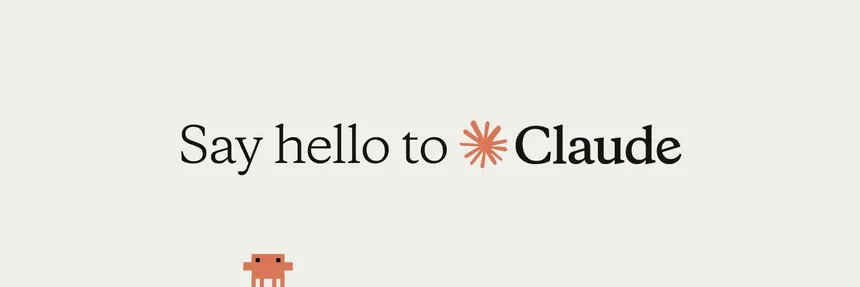

<p align="center"></p>
<h1 align="center"> Claude AI </h1> 
<h4 align="right">Jul 26</h4>

<p>
  
  
</p>

<br>

# Table of contents
- [Table of contents](#table-of-contents)
  - [Skill (Habilidad)](#skill-habilidad)
  - [MCP (Model Context Protocol)](#mcp-model-context-protocol)

<br>


## Skill (Habilidad)

Una Skill es una capacidad específica que un sistema AI puede ejecutar para resolver una tarea concreta.

Ejemplos:

* "Convertir un PDF a texto"
* "Consultar una base de datos"
* "Enviar un correo"
* "Controlar una impresora 3D"
* "Generar un reporte Excel"

Una Skill normalmente tiene:

* Nombre
* Descripción de lo que hace
* Parámetros de entrada
* Resultado esperado
* Reglas de uso

> :bulb: **Tip:** Un agente AI puede decidir cuándo usar esa Skill.

## MCP (Model Context Protocol)

MCP = Model Context Protocol

Es un estándar creado para conectar modelos AI con herramientas, datos y sistemas externos de forma estructurada.

La idea es:
```
Modelo AI
    |
    |
    MCP
    |
-----------------
|       |       |
Base   API    Archivo
datos          sistema
```
En vez de programar una integración diferente para cada AI, MCP define una forma común.

Ejemplos de recursos conectables:

* Bases de datos
* GitHub
* Sistemas internos
* APIs
* Archivos locales
* Herramientas empresariales

Ejemplo:
Un asistente AI recibe:
"Busca los errores del proyecto y crea un reporte"
El modelo usa MCP para:

1. Leer repositorio
2. Revisar logs
3. Crear documento

<br>

---

<div>
  <p>
     Copyright &nbsp;&copy; 2023 Instinto Digital <a href="https://carjavi.github.io/" title="carjavi.github">carjavi</a>
  </p>
</div>

<p align="center">
    <a href="https://instintodigital.net/" target="_blank"></a>
</p>


