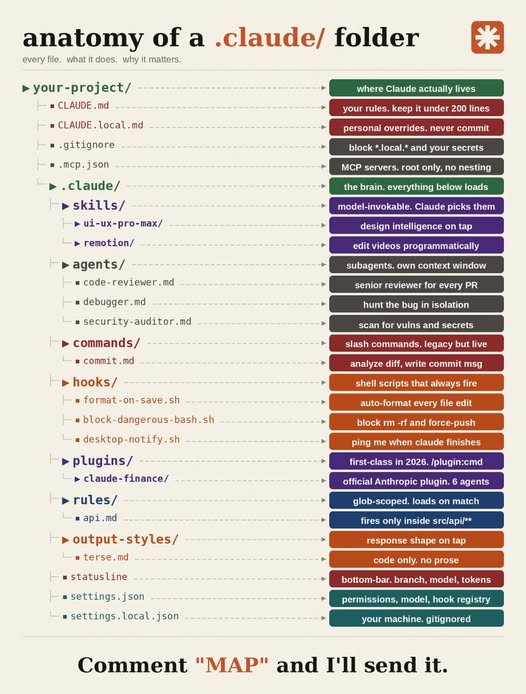
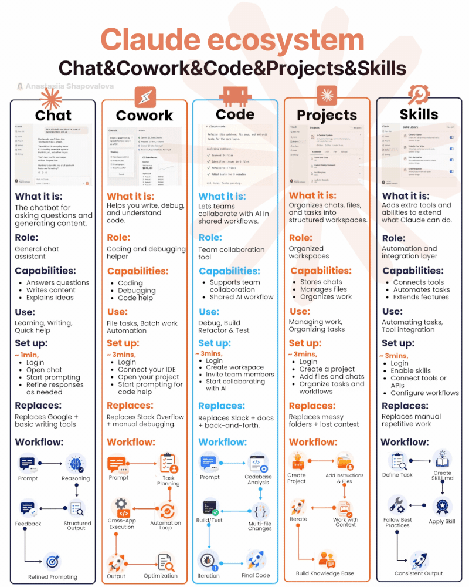

<p align="center"></p>
<h1 align="center"> Claude AI </h1> 
<h4 align="right">Jul 26</h4>

<p>
  
  
</p>

<br>

# Table of contents
- [Table of contents](#table-of-contents)
- [Claude desde terminal:](#claude-desde-terminal)
  - [Install](#install)
  - [Start](#start)
  - [Comandos de Claude desde el Terminal](#comandos-de-claude-desde-el-terminal)
  - [Comandos esenciales](#comandos-esenciales)
  - [Comandos de razonamiento y estructura](#comandos-de-razonamiento-y-estructura)
  - [Comandos de revisión y crítica](#comandos-de-revisión-y-crítica)
  - [Comandos de estilo y tono](#comandos-de-estilo-y-tono)
- [Ciclo de modos de permiso de Claude](#ciclo-de-modos-de-permiso-de-claude)
  - [Plan Mode On](#plan-mode-on)
  - [Auto Mode On](#auto-mode-on)
  - [Modo normal (sin etiqueta)](#modo-normal-sin-etiqueta)
  - [Auto-Accept Mode](#auto-accept-mode)
  - [Iniciar sesión directamente en Plan Mode:](#iniciar-sesión-directamente-en-plan-mode)
- [Autonomia de Claude](#autonomia-de-claude)
  - [Bypass Mode ("YOLO mode")](#bypass-mode-yolo-mode)
- [Setting Claude](#setting-claude)
  - [CLAUDE.md](#claudemd)
    - [ubicación](#ubicación)
- [Tools Claude](#tools-claude)
- [Skills](#skills)
  - [Skill (Definition)](#skill-definition)
  - [MCP (Model Context Protocol)](#mcp-model-context-protocol)

<br>

<p align="center"></p>

<br>

<p align="center"></p>

# Claude desde terminal:
## Install
Desde PowerShell:
```PowerShell
irm https://claude.ai/install.ps1 | iex
```

Desde CMD:
```PowerShell
curl -fsSL https://claude.ai/install.cmd -o install.cmd && install.cmd && del install.cmd
```

Solo falta agregar esa carpeta a tu PATH: <br>
PowerShell
```PowerShell
$p=[Environment]::GetEnvironmentVariable('Path','User');if($p -notlike "*$env:USERPROFILE\.local\bin*"){[Environment]::SetEnvironmentVariable('Path',"$p;$env:USERPROFILE\.local\bin",'User')}
```
> :warning: **Warning:** Después cierra PowerShell por completo y abre una ventana nueva (esto es importante, el cambio no aplica a la ventana actual). 
>
> Recomiendo la de PowerShell — no tiene el límite de 1024 caracteres que causó la corrupción de tu Machine PATH.

> :warning: **Warning:** Si hay error probar si el problemas es de sesion. 
```PowerShell
& "$env:USERPROFILE\.local\bin\claude.exe"
```

## Start
Escribe:  ```claude```

| Comando | Definition |
|---|---|
| `/login` | Autentica al usuario en Claude. |
| `Esc` | Interrumpe a Claude si está trabajando. |
| `/help` | Muestra los comandos disponibles. |
| `/skills` | Muestra todos los Skills disponibles. |
| `/plugin list` | Muestra los plugins instalados. |
| `/exit` | Sale de Claude Code. |
| `Ctrl+C` | Sale de Claude Code o interrumpe la operación actual. |
| `/doctor` | Diagnostica problemas en la instalación o configuración de Claude Code. |
| `/remote-control` | Permite controlar una sesión de Claude Code de forma remota desde otro dispositivo. |
| `/config` | Permite consultar y modificar la configuración de Claude Code. |

<br>

## Comandos de Claude desde el Terminal  
```PowerShell
claude --version        # Muestra la versión instalada de Claude Code.
claude --resume         # Reanuda una sesión anterior de Claude Code. Puede permitir seleccionar qué sesión quieres continuar.
claude -c               # Continúa/reanuda la última conversación o sesión en el directorio actual. Es una forma abreviada de claude --continue.
claude --allow-dangerously-skip-permissions             # Arranca en modo normal, pero agrega bypass al ciclo de Shift+Tab, así puedes activarlo y desactivarlo cuando quieras dentro de la misma sesión
claude --allow-dangerously-skip-permissions --resume    # Si quieres retomar el contexto sin perder tu conversación
```

> :memo: **Note:** Deberia correr tambien desde CMD, PowerShell 
> :memo: **Note:** Carpeta de configuracion de claude ```cd ~/.claude/``` o ```%USERPROFILE%\.claude\skills\```

<br>

## Comandos esenciales 

| Comando | Posición | Qué hace |
|---|---|---|
| `/stepbystep` | Inicio | Estructura la respuesta en pasos secuenciales, claros y fáciles de seguir. |
| `ULTRATHINK` | Inicio | Activa razonamiento extendido y profundo para preguntas complejas donde una respuesta rápida no alcanza. |
| `/expand` | Inicio | Profundiza el tema con más contexto, ejemplos y detalle. |
| `/simplify` | Inicio | Simplifica al máximo la explicación, como si fuera para alguien sin conocimiento previo. |
| `L99` | Inicio | Responde con el nivel de un experto senior en la materia. |

## Comandos de razonamiento y estructura

| Comando | Posición | Qué hace |
|---|---|---|
| `/firstprinciples` | Inicio | Descarta todos los supuestos previos y reconstruye la respuesta razonando desde cero. |
| `OODA` | Final | Aplica el framework militar Observar-Orientar-Decidir-Actuar para estructurar una decisión o plan de acción. |
| `ALT3` | Inicio | Genera 3 alternativas distintas de respuesta para comparar enfoques. |

## Comandos de revisión y crítica

| Comando | Posición | Qué hace |
|---|---|---|
| `/critic` | Inicio | Claude adopta un rol crítico exigente y ataca la idea buscando activamente sus puntos débiles. |

## Comandos de estilo y tono

| Comando | Posición | Qué hace |
|---|---|---|
| `/ghost` | Inicio | Reescribe el texto para que suene natural y humano, sin marcas típicas de IA. |

<br>

# Ciclo de modos de permiso de Claude
```Auto mode on / Modo Plan / Modo Ejecución / Modo Normal```. Atajo de teclado: presiona ```Shift+Tab``` para alternar entre modos de permiso:

## Plan Mode On
Es casi lo opuesto al Auto-Accept. En este modo, Claude Code puede leer y analizar todo lo que quiera, pero no puede modificar ningún archivo ni ejecutar ningún comando. Todo lo que puede hacer es mirar y pensar — y luego darte un plan. Tú revisas el plan, haces preguntas, pides ajustes, y solo cuando estás conforme cambias de modo y le dices que proceda. 

A diferencia de ***Auto-Accept*** (que solo evita preguntarte por ediciones de archivo pero sigue pidiendo permiso para comandos de shell), Auto mode va más allá: también decide por sí mismo qué comandos de terminal son seguros de ejecutar, sin pedirte confirmación — pero tiene bloqueos duros para lo peligroso.

## Auto Mode On
Automatiza las aprobaciones de permisos para escritura de archivos y comandos bash usando un clasificador integrado. Las acciones seguras se ejecutan automáticamente, mientras que las potencialmente destructivas se bloquean sin pedirte nada. Auto-aprueba lo que juzga seguro y solo se detiene ante acciones genuinamente destructivas (borrados, wipes, rm -rf)

## Modo normal (sin etiqueta)
El modo estándar. Claude pide confirmación antes de modificar cualquier archivo o ejecutar cualquier comando. Cada cambio pasa por una aprobación manual tuya, uno por uno. Es el más seguro, pero el más lento si estás haciendo muchos cambios seguidos. 

## Auto-Accept Mode 
Claude aplica automáticamente las ediciones de archivos sin pedir confirmación para cada una. Aún pide permiso antes de ejecutar comandos de shell, pero los cambios de archivo ocurren de inmediato. Es un punto medio: ganas velocidad en ediciones de código, pero mantienes cierto control sobre comandos potencialmente peligrosos (como borrar algo o instalar paquetes). 


> :memo: **Note:** Escribe ```/plan``` directamente en el prompt para entrar en modo planificación sin necesidad del atajo de teclado, especialmente útil si ya estás a mitad de una conversación. 

> :memo: **Note:** ```Shift+Tab``` tiene comportamientos inconsistentes según versión de claude


## Iniciar sesión directamente en Plan Mode:

```bash
claude --permission-mode plan
```

# Autonomia de Claude 
Recomendación primero probar con el modo **Auto-Accept Mode** o **Auto Mode On**, y si se le quiere dar mayor control Claude usar **modo Bypass**.

## Bypass Mode ("YOLO mode")
Salta todas las verificaciones de permisos. Claude ejecuta cualquier herramienta sin preguntar.<br>

Activar Bypass Mode: ```Desde el Terminal```
```Bash
claude --allow-dangerously-skip-permissions # Arranca en modo normal, pero agrega bypass al ciclo de Shift+Tab, así puedes activarlo y desactivarlo cuando quieras dentro de la misma sesión
claude --dangerously-skip-permissions       # Arranca Sesion ya activo en bypassPermissions. No puedes salir de ese modo sin reiniciar la sesión completa.

# Esto reabre tu última sesión (con todo el historial/contexto) pero ahora con el flag activo, para que Shift+Tab te deje entrar a bypass.
claude --allow-dangerously-skip-permissions --resume    # Si quieres retomar el contexto sin perder tu conversación
claude --allow-dangerously-skip-permissions -c          # Si quieres retomar el contexto sin perder tu conversación

```
> :memo: **Note:** Los comandos para iniciar el modo Yolo no es un comando que puedas escribir dentro de una sesión ya iniciada. Es solo desde el arranque (Es un flag de arranque), no se puede inyectar después.

> :memo: **Note:** Dependiendo como se active el modo Yolo, se puede activar o no en una sesison. 


# Setting Claude

## CLAUDE.md
Ese archivo se carga automáticamente en cada sesión de Claude Code, sin importar el proyecto en el que estés. Los archivos de alcance global viven en ~/.claude/ y aplican a todos los proyectos, mientras que los de alcance de proyecto viven en el repo

### ubicación
```bash
~/.claude/CLAUDE.md	                     # Global — todos tus proyectos
.claude/CLAUDE.md (dentro del repo) 	 # Proyecto — se puede versionar y compartir con el equipo
```


<br>

# Tools Claude

```Claude-StatusBar``` Status Bar para Claude Code escrito en bash. Muestra modelo, contexto, tokens, rate limits y duración de sesión en una sola línea, con animaciones suaves a 1 Hz.
Install:
```PowerShell
git clone https://github.com/afsh4ck/Claude-Status-Bar.git
cd Claude-Status-Bar
bash install.sh
```
> :warning: **Warning:** Reinicia Claude Code una vez finalizado.

> :warning: **Warning:** Si hay un error como :
```PowerShell
/c/Users/carja/AppData/Local/Microsoft/WindowsApps/python3: Permission denied
```
Edita el install.sh linea 37
después de esta linea: 
```PowerShell
_python=$(command -v python 2>/dev/null || command -v python3 2>/dev/null || echo "")
```
pon esta:
```PowerShell
_python=$(command -v python3 2>/dev/null || command -v python 2>/dev/null || echo "")

if [[ "$_python" == *"WindowsApps/python3"* ]]; then
    _python=$(command -v python 2>/dev/null || echo "")
fi
```


<br>

# Skills
Inicialmente es necesario crear la carpeta
```PowerShell
mkdir -p ~/.claude/skills
```
<br>

```prompt-master``` es una skill que te ayuda a redactar mejores prompts para cualquier herramienta de IA (Claude, ChatGPT, Midjourney, Cursor, etc.), en lugar de que tú lo hagas a mano por ensayo y error.
```PowerShell
git clone https://github.com/nidhinjs/prompt-master.git ~/.claude/skills/prompt-master
```
***Usage:*** I need a prompt for Claude Code to build...

<br>

```grill-me``` (Interrogame) es un Skill para Claude Code cuyo objetivo es evitar que el modelo empiece a programar haciendo suposiciones. En lugar de generar código inmediatamente, el skill te entrevista de forma sistemática hasta entender completamente el problema.
Agregar el Marketplace:
```bash
# Dentro de Claude Code ejecuta:
/plugin marketplace add alirezarezvani/claude-skills
/plugin install grill-me@claude-code-skills
/plugin list # para verificar que esta instalado
```
***Usage:*** Quiero hacer un sistema... Grill me on this architecture... Grill me before implementing this project.


<br>

## Skill (Definition)

Una Skill es una capacidad específica que un sistema AI puede ejecutar para resolver una tarea concreta.

Ejemplos:

* "Convertir un PDF a texto"
* "Consultar una base de datos"
* "Enviar un correo"
* "Controlar una impresora 3D"
* "Generar un reporte Excel"

Una Skill normalmente tiene:

* Nombre
* Descripción de lo que hace
* Parámetros de entrada
* Resultado esperado
* Reglas de uso

> :bulb: **Tip:** Un agente AI puede decidir cuándo usar esa Skill.

<br>

## MCP (Model Context Protocol)

MCP = Model Context Protocol

Es un estándar creado para conectar modelos AI con herramientas, datos y sistemas externos de forma estructurada.

La idea es:
```
Modelo AI
    |
    |
    MCP
    |
-----------------
|       |       |
Base   API    Archivo
datos          sistema
```
En vez de programar una integración diferente para cada AI, MCP define una forma común.

Ejemplos de recursos conectables:

* Bases de datos
* GitHub
* Sistemas internos
* APIs
* Archivos locales
* Herramientas empresariales

Ejemplo:
Un asistente AI recibe:
"Busca los errores del proyecto y crea un reporte"
El modelo usa MCP para:

1. Leer repositorio
2. Revisar logs
3. Crear documento

<br>

<p align="center"></p>


<br>

---

<div>
  <p>
     Copyright &nbsp;&copy; 2023 Instinto Digital <a href="https://carjavi.github.io/" title="carjavi.github">carjavi</a>
  </p>
</div>

<p align="center">
    <a href="https://instintodigital.net/" target="_blank"></a>
</p>


